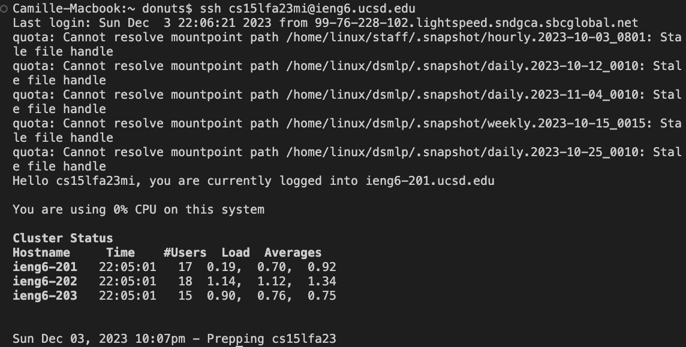

# CSE 15L: LAB REPORT 4
## by Camille Saldajeno
---
### step 4:

keys pressed: <up> <up> <enter>

The ssh cs15lfa23mi@ieng6.ucsd.edu command was up 2 in the history, so I pressed up twice then enter in order to copy it on the terminal and run it.
