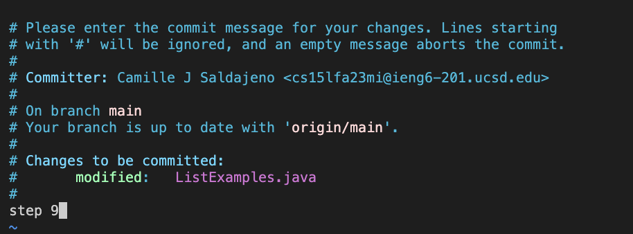

# CSE 15L: LAB REPORT 4
## by Camille Saldajeno
---

### step 4:

keys pressed: `<up><up><enter>`

The `ssh cs15lfa23mi@ieng6.ucsd.edu` command was up 2 in the history, so I pressed `<up>` twice then `<enter>` in order to copy it on the terminal and run it.
---

### step 5:

keys pressed: `<ctrl> r`

outputs: (reverse-i-search)`':

keys pressed: `git`

keys pressed: `<enter>`

I initally copied and pasted git clone https://github.com/ucsd-cse15l-s23/lab7 on the terminal to run, so it was already in my history. I could've also pressed `<up>` then enter, but decided to press `<ctrl>` and r simultaneously, type git and then press enter.
---

### step 6:

keys pressed: `cd lab7 <enter>`
keys pressed: `bash test.sh <enter>`

I was in the home directory, so I had to cd to lab7 directory by typing cd lab7 and then `<enter>`. Afterwards, I typed bash.test.sh and then pressed `<enter>` to run the tests.
---

### step 7:

keys pressed: `vim ListExamples.java <enter>`
keys pressed: `<up><up><up><up><up><up><right><right><right><right><right><right><right><right><right><right><right><right><i><backspace><2><esc><:wq>`

I typed vim ListExamples.java and pressed enter. Next, I  pressed `<up>` 6x to go to line that says index1 += 1; . Then, I pressed `<right>` 12x to reach the position after 1, pressed `<i>` for insert mode, <backspace> to delete the 1, and 2 to replace it. Finally, I pressed `<esc>` and typed `:wq` to quit and save my changes. I changed index1 += 1; to index2 += 1;
---
### step 8:

keys pressed: `<up><up><enter>`

I ran bash.sh from the previous step, so I pressed `<up>` 2x to get it and `<enter>` to rerun it.

---

### step 9:

keys pressed: `git add .`

keys pressed: `<enter>`

keys pressed: `git commit`

keys pressed: `<enter>`

keys pressed: `<down><down><down><down><down><down><down><down><down><down><down><i><step 9><esc><:wq>`

I typed git add . then pressed `<enter>` to add files in current directory and subdirectory to the staging area. Afterwards, I typed git commit and pressed enter again to ensure that it was pushed to the repository. To add a commit message, I pressed `<down>` 11x, then <i> to enter insert mode and typed `step 9`. Finally, I pressed `<esc>` to go back to normal mode and typed `:wq` to quit and save my changes.

